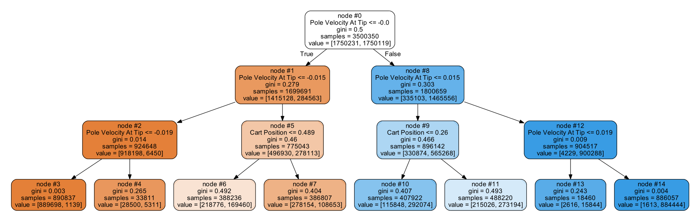

# DTRL
This project is for
"Finding Explainable and Transferable Meta-Knowledge of Reinforcement Learning".
These algorithms will make original RL algorithms more interpretable and transferable. 
In this project, We employ Asynchronous Advantage Actor-critic (A3C)
and Proximal Policy Optimization (PPO) to combine DTRL,
to form DTA3C and DTPPO respectively.
Optional envs include CartPole, MountainCar, Acrobot, Pendulum,InvertedPendulum, Swimmer, Hopper and BipedalWalke.

## Prerequisites 
It requires python3 (>=3.5). 
In order to install requirements, follow:
```bash
conda create --name dtrl python=3.5
conda activate dtrl
pip install -r requirements.txt
```

If you need to visualize the decision tree like fig, please install graphviz in	http://www.graphviz.org/ 

## File Descriptions

### All Python files can be mainly divided into three main sections

#### 1. Oringinal RL, used to train and test the original RL algorithms and collect interactive data

##### (1) A3C_Original.py
The A3C algorithm implement in discrete action version.
```bash
python A3C_Original.py --mode 'train' --env "Acrobot-v1" --render False --load False
--getting_data True
```
##### (2) DPPO_Original.py
The PPO algorithm implement for continuous action for Gym env.
```bash
python DPPO_Original.py --mode 'train' --env "Pendulum-v1" --render False --load False --getting_data True
```

##### (3) DPPO_MUJOCO_Original.py
The PPO algorithm implement for MUJOCO env.
```bash
python DPPO_MUJOCO_Original.py --mode 'train' --env "BipedalWalke-v1" --render False --load False --getting_data True
```

###### NOTE
`--mode` 'train' or 'test'.  
`--load False`: if True, trained network is loaded during retraining.  
`--getting_data` True: if True, collect data for generating tree model when test.

#### 2. Decision Tree, used to generate tree model for finding meta-knowledge for tasks

##### (1) DecisionTree.py
Classification Decision Tree, it used for discrete action version.
```bash
python DecisionTree.py --env "Acrobot-v1" 
```

##### (2) RegressionDecisionTree.py
Regression Decision Tree, it used for discrete action version.
```bash
python DRegressionDecisionTree.py --env "BipedalWalke-v1" 
```

#### 3. DTRL, utilize both the nonlinear fitting ability of RL algorithm and the interpretation of decision tree.

##### (1) A3C_transfer.py
The DTA3C algorithm implement in discrete action version.
```bash
python A3C_transfer.py --mode 'train' --env "Acrobot-v1" --render False --load False --mixed_version True
```
##### (2) DPPO_transfer.py
The DTPPO algorithm implement for continuous action for Gym env.
```bash
python DPPO_transfer.py --mode 'train' --env "Pendulum-v1" --render False --load False --mixed_version True
```

##### (3) DPPO_MUJOCO_Transfer.py
The DTPPO algorithm implement for MUJOCO env.
```bash
python DPPO_MUJOCO_Transfer.py --mode 'test' --env "BipedalWalke-v1" --render False --load False --mixed_version True
```

###### NOTE
`--mode` 'train' or 'test'.  
`--load False`: if True, trained network is loaded during retraining.  
`--mixed_version` True: if True, DTRL, otheriwise, DT.  
